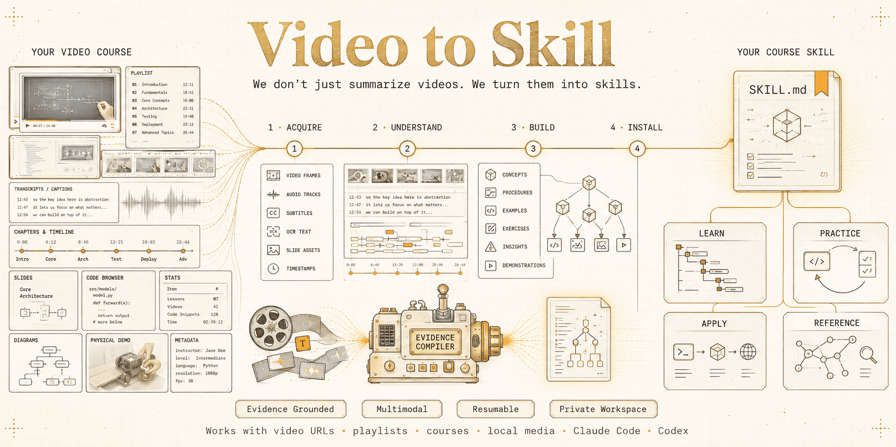

# video-to-skill

Turn a video, playlist, or course into an evidence-grounded Skill that Claude Code or Codex can teach from, quiz you on, use as a reference, and apply to real work.

<p align="center">
  
</p>

## Install

Paste this request into Claude Code or Codex:

```text
Install video-to-skill globally as a standalone Skill from https://github.com/Lum1104/video-to-skill. Prepare and verify its private runtime, then confirm that video-to-skill is available.
```

Or install it for both hosts with the open [Agent Skills installer](https://github.com/vercel-labs/skills):

```bash
npx skills add Lum1104/video-to-skill --skill video-to-skill --global --agent claude-code --agent codex --yes
```

The command-line option requires Node.js and `npx`. Start a new host session after installation.

On first use, the Skill creates a private Python runtime and downloads its third-party dependencies from PyPI; that setup needs Python 3.11–3.13 and network access. Processing media also requires FFmpeg with ffprobe. If a course later needs local speech recognition or OCR, the host enables that capability inside the same private runtime; you do not create a virtual environment or run a package manager yourself.

## Create a course Skill

Give the generator a video, playlist, course URL, or local media file:

| Host | Example |
| --- | --- |
| Claude Code | `/video-to-skill https://www.youtube.com/playlist?list=...` |
| Codex | `$video-to-skill https://www.youtube.com/playlist?list=...` |

You can add the desired outcome naturally:

```text
Build a Skill that teaches this course and can apply its method to my projects.
```

One invocation inventories the accessible course, acquires and investigates the evidence, builds and validates a course-specific Skill, and installs it for the active host. Interrupted work resumes from its private evidence workspace.

## Use the generated Skill

If the generated Skill is named `react-performance-course`, use `/react-performance-course` in Claude Code or replace the leading `/` with `$` in Codex:

| Goal | Example request |
| --- | --- |
| Learn | `/react-performance-course Check what I know, then teach me the first topic.` |
| Practice | `/react-performance-course Give me an exercise and review my attempt.` |
| Apply | `/react-performance-course Inspect this repository using the course's method.` |
| Reference | `/react-performance-course What did the course recommend for this failure mode?` |

The generated course Skill is the tutor, practice partner, operational guide, and reference. There is no second generic tutor to install.

See [Ambitious AI Startup Playbook](https://github.com/Lum1104/ambitious-ai-startup-playbook) for a real generated Skill. It is pinned in this repository as a submodule under `generated-skills/`; fetch it locally with `git submodule update --init --recursive`.

## What it does

1. **Acquire:** resolve every accessible course item and collect the metadata, captions, audio, and analysis-quality video needed for understanding.
2. **Understand:** align speech, chapters, scene changes, OCR, and visual states. Claude Code or Codex inspects contact sheets with native multimodal vision and requests short, dense frame windows only where an important action remains ambiguous.
3. **Build:** synthesize concepts, demonstrations, exercises, playbooks, references, and timestamped provenance instead of dumping a transcript.
4. **Validate and install:** critique grounding and coverage, reject private or unsafe artifacts, install the generated Skill without overwriting different same-name content, and return its invocation.

“Full course” means inventorying and processing every accessible item within explicit safety limits, not downloading archival-quality copies. The media pipeline retrieves complete timelines when needed and normally caps analysis video at 720p. Failed or inaccessible items remain visible in the final coverage report; successful items are not discarded because another item failed.

The runtime is isolated from your project. Its fingerprint covers the Python minor version, absolute source location, dependency manifest, and installation-relevant engine sources. Matching healthy runtimes are reused; a damaged runtime is rebuilt once under a process lock instead of entering a repair loop. Local ASR, OCR, and speaker separation are installed only when the selected evidence route requires them, which can trigger additional package or model downloads.

When browser authentication is enabled, the engine decrypts browser cookies once, creates private per-worker temporary snapshots, and removes them when the command exits. A supplied `cookies.txt` file is snapshotted rather than modified in place.

## Privacy, access, and copyright

- Raw media, subtitles, frames, cookies, credentials, transcripts, and the evidence database stay in the private workspace and are excluded from generated Skills.
- Native host vision avoids sending frames to an additional vision provider by default, although Claude Code or Codex still processes opened evidence under its own data policy.
- Authentication is opt-in and must use access you are authorized to use. The project does not bypass DRM, paywalls, removed content, or platform permissions.
- Generated notes and sparse screenshots can still be subject to copyright, contracts, privacy duties, or platform terms. You are responsible for permission to process and distribute the source material.

## Design and development

The deterministic Python layer handles acquisition, timestamps, caching, retrieval, and validation. The host agent plans the multimodal investigation, delegates bounded work to expert subagents when useful, and authors the final Skill.

The multimodal evidence workflow is also informed by the caption-plus-screenshot approach in [Youtube2Webpage](https://github.com/obra/Youtube2Webpage).

See the [generated Skill V2 design](docs/generated-skill-v2.md), [developer guide](docs/development.md), [architecture](docs/architecture.md), [provider configuration](docs/providers.md), and [security model](docs/security.md).

Thanks to [book-to-skill](https://github.com/virgiliojr94/book-to-skill) for the inspiration.
